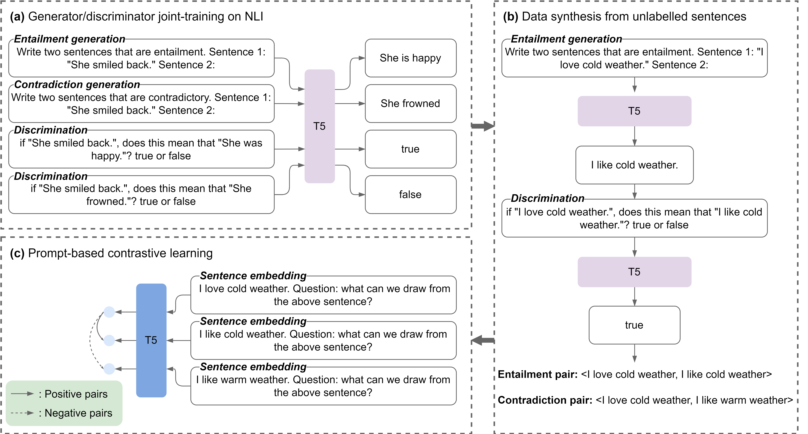

## GenSE

Official implementation of EMNLP 2022 paper [Generate, Discriminate, and Contrast: A Semi-Supervised Sentence Representation Learning Framework](https://arxiv.org/abs/2210.16798)

### Overview
We propose a semi-supervised sentence embedding framework, GenSE, that effectively leverages large-scale unlabeled data. Our method include three parts: 
* **Generate:** A generator/discriminator model is jointly trained to synthesize sentence pairs from open-domain unlabeled corpus.
* **Discriminate:** Noisy sentence pairs are filtered out by the discriminator to acquire high-quality positive and negative sentence pairs.
* **Contrast:** A prompt-based contrastive approach is presented for sentence representation learning with both annotated and synthesized data. 


### Requirements
To run our code, please install all the dependency packages by using the following command:
```shell script
pip install -r requirements.txt
```

### Data Synthesis
We train a unified T5 model for data generation and discrimination. Details about data synthesis can be found in  ``data_synthesis/README.md``.

### GenSE Training & Evaluation
After data synthesis, we can train GenSE sentence embedding model follows ``gense_training/README.md``


### Model List
All of our pre-trained models are now available from huggingface hub:

| Model |
| :---   |
| [mattymchen/nli-synthesizer-t5-base](https://huggingface.co/mattymchen/nli-synthesizer-t5-base)   |
| [mattymchen/gense-base]() |
| [mattymchen/gense-base-plus](https://huggingface.co/mattymchen/gense-base-plus) |

#### Example usage
##### Generation & Discrimination
```python
from transformers import T5ForConditionalGeneration, AutoTokenizer

# load data synthesis model
synthesis_model = T5ForConditionalGeneration.from_pretrained('mattymchen/nli-synthesizer-t5-base', use_auth_token=True)
synthesis_tokenizer = AutoTokenizer.from_pretrained('mattymchen/nli-synthesizer-t5-base', use_auth_token=True)

# prepare inputs
input_sents = [
    'Write two sentences that are entailment. Sentence 1: \"The task of judging the best was not easy.\"Sentence 2:',
    'Write two sentences that are contradictory. Sentence 1: \"The task of judging the best was not easy.\"Sentence 2:',
    'if \"The task of judging the best was not easy.\", does this mean that \" It was difficult to judge the best.\"? true or false',
    'if \"The task of judging the best was not easy.\", does this mean that \" It was easy to judge the best.\"? true or false'
]
input_features = synthesis_tokenizer(input_sents, add_special_tokens=True, padding=True, return_tensors='pt')

# generation
outputs = synthesis_model.generate(**input_features, top_p=0.9) 

# Outputs:
# It was difficult to judge the best.
# It was easy to judge the best.
# true
# false
print(synthesis_tokenizer.batch_decode(outputs, skip_special_tokens=True))
```


### Synthetic Data
We run our unified data synthesis model on open domain unlabeled sentences to obtain synthetic NLI triplets for GenSE training.

The resulting synthetic dataset SyNLI contains around 61M NLI triplets, which can now be downloaded from huggingface hub:
```python
from datasets import load_dataset

dataset = load_dataset("mattymchen/synli")
```


### Citation
Please cite our paper if you use GenSE in your work:
```
@inproceedings{chen2022gense,
  title={Generate, Discriminate and Contrast: A Semi-Supervised Sentence Representation Learning Framework},
  author={Chen, Yiming and Zhang, Yan and Wang, Bin and Liu, Zuozhu and Li, Haizhou},
  booktitle={Empirical Methods in Natural Language Processing (EMNLP)},
  year={2022}
}
```